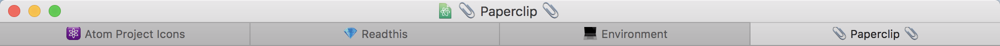
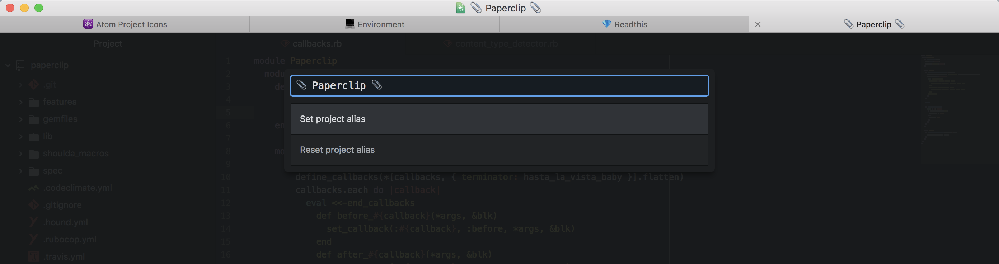

# Project Icons

Atom package for improved visual identification of projects.  This package allows you to add emoji or custom text to the project tab.  Particularly helpful for multiple projects open in the same window.



https://atom.io/packages/project-icons

## Usage

<kbd>ctrl-alt-cmd-i</kbd> to toggle the project alias modal.



## Installation

Open __Settings__ <kbd>cmd-,</kbd> and then click __Install__.  Search for the package with `project-icons`.

Alternatively, install through the command line.

```
apm install project-icons
```
